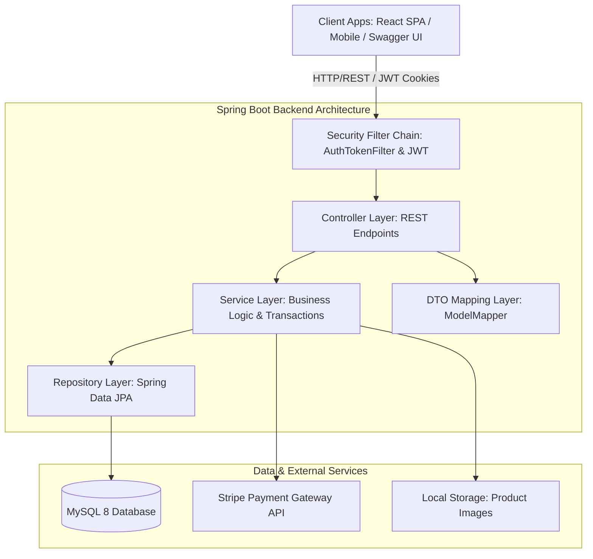
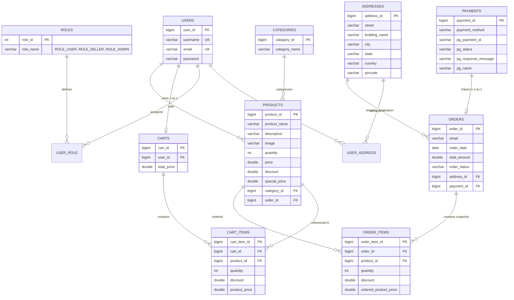

# E-Shop — Production-Grade Enterprise E-Commerce Platform

[](https://www.oracle.com/java/)
[](https://spring.io/projects/spring-boot)
[](https://spring.io/projects/spring-security)
[](https://www.mysql.com/)
[](https://react.dev/)
[](https://stripe.com/)
[](http://localhost:8080/swagger-ui/index.html)

---

##  Executive Overview

**E-Shop** is a backend-first, enterprise-grade E-Commerce platform engineered with **Java 17**, **Spring Boot 3.5.3**, and **Spring Security 6**. Designed with production architecture in mind, this project demonstrates advanced backend patterns—including stateless **JWT authentication**, dynamic multi-criteria search with **JPA Specifications**, atomic order lifecycle management via **Spring `@Transactional`**, **Stripe Payment Gateway integration**, **Role-Based Access Control (RBAC)**, and clean database schema modeling.

Rather than focusing solely on basic CRUD operations or front-end visuals, E-Shop models the **internal architecture and system engineering** required for real-world enterprise web applications.

---

## System Architecture & Design Philosophy

The application strictly adheres to a **Clean Layered Architecture** and the **Separation of Concerns (SoC)** principle:



### Key Architectural Tenets
* **Backend-First Engineering**: Core business rules (pricing, stock availability, discount calculations, order conversion) reside strictly in the service layer.
* **DTO Pattern (Data Transfer Objects)**: API contracts (`*DTO`, `*Response`) are fully decoupled from persistent JPA entities (`*Entity`) using `ModelMapper`, preventing sensitive fields (e.g., hashed passwords) from being leaked.
* **Stateless Security**: Zero HTTP session state (`SessionCreationPolicy.STATELESS`); authentication state is verified per request via JWT stored in HTTP-Only Cookies or Authorization headers.
* **Centralized Exception Handling**: API error responses follow a uniform contract managed by `@RestControllerAdvice`.

---

## Database Design & Entity-Relationship Architecture

The relational schema is normalized and configured via **Spring Data JPA & Hibernate** targeting **MySQL 8.0/PostgreSQL**.

###  Entity-Relationship (ER) Diagram



###  Database Design Highlights
1. **Junction Tables (`user_role`, `user_address`)**: `@ManyToMany` mappings allow users to possess multiple roles (`ROLE_USER`, `ROLE_SELLER`, `ROLE_ADMIN`) and manage multiple shipping addresses.
2. **Transactional Snapshotting (`Order` vs `Cart`)**: When an order is placed, line items are copied from `CartItem` to `OrderItem` along with historical prices (`orderedProductPrice`), ensuring future product price changes do not retroactively modify past order invoices.
3. **Cascading & Orphan Removal**: `Cart` ↔ `CartItem` configured with `orphanRemoval = true` and `CascadeType.REMOVE` to automatically clear line items when a user clears their cart.
4. **Calculated Special Price**: Products support base pricing and percentage discounts; `specialPrice` is dynamically calculated and synchronized across carts during updates.

---

##  Technical Skills & Engineering Practices Demonstrated

### 1.  Advanced Security & Authentication Strategy
* **JWT Engine (`JwtUtils`)**: Uses `io.jsonwebtoken` (JJWT `0.12.5`) with HMAC SHA-256 signatures. Supports both **HTTP-Only Cookies** (web UI security against XSS) and **Bearer Tokens** (Swagger & mobile client integration).
* **Filter Chain Customization (`WebSecurityConfig`)**: Intercepts requests with `AuthTokenFilter` extending `OncePerRequestFilter`, decoding claims and loading authentication into `SecurityContextHolder`.
* **Password Hashing**: Passwords stored using `BCryptPasswordEncoder`.
* **Database Initialization (`CommandLineRunner`)**: Automatically seeds default roles (`ROLE_USER`, `ROLE_SELLER`, `ROLE_ADMIN`) and system users upon application startup.

### 2.  Data Access, Dynamic Queries & Pagination
* **Dynamic Search with JPA Specifications**: Implemented using `Specification<Product>` criteria builder, supporting real-time keyword matching (`LIKE %keyword%`) and category filtering simultaneously.
* **Server-Side Pagination & Sorting**: Custom response wrappers (`ProductResponse`, `CategoryResponse`) encapsulate page metadata (`pageNumber`, `pageSize`, `totalElements`, `totalPages`, `isLastPage`) powered by Spring Data `Pageable` and `Sort`.

### 3.  Transactional Integrity & Inventory Management
* **Atomic Order Placement (`@Transactional`)**: `OrderServiceImpl.placeOrder` executes within an atomic transaction boundary. It:
  1. Validates cart non-emptiness and address validity.
  2. Persists `Payment` metadata.
  3. Converts `CartItem` collection into `OrderItem` entities.
  4. Atomically decrements product inventory stock (`productRepository.save`).
  5. Flushes and deletes cart contents.
  *If any step fails, the transaction rolls back completely, maintaining strict DB consistency.*

### 4.  Payment Gateway Integration
* **Stripe Server-Side Integration**: Interfaced with `stripe-java` SDK to generate server-side `PaymentIntent` tokens returned to the React frontend for client-side Stripe Elements checkout.

### 5.  Centralized Exception Handling & Validation
* **Global Exception Advice (`MyGlobalExceptionHandler`)**: Intercepts:
  * `MethodArgumentNotValidException`: Maps constraint violations to field-level error key-value pairs.
  * `ResourceNotFoundException`: Generates standardized 404 API responses.
  * `APIException`: Handles custom domain rule failures with 400 Bad Request responses.

---

##  API Specification Overview

The API is fully documented via **OpenAPI 3.0 (Swagger UI)** available at `/swagger-ui/index.html`.

| Module | Method | Endpoint | Access Level | Description |
| :--- | :--- | :--- | :--- | :--- |
| **Auth** | `POST` | `/api/auth/signup` | Public | Register new user account |
| **Auth** | `POST` | `/api/auth/signin` | Public | Authenticate user & issue JWT cookie |
| **Auth** | `POST` | `/api/auth/signout` | Authenticated | Invalidate JWT cookie |
| **Category**| `GET` | `/api/public/categories` | Public | List paginated categories |
| **Category**| `POST` | `/api/public/categories` | Admin | Create new product category |
| **Category**| `DELETE`| `/api/admin/categories/{id}` | Admin | Remove category |
| **Product** | `GET` | `/api/public/products` | Public | Paginated product search & filter |
| **Product** | `POST` | `/api/admin/categories/{id}/product` | Admin / Seller | Add new product to category |
| **Product** | `PUT` | `/api/products/{id}/image` | Admin / Seller | Upload product image |
| **Cart** | `POST` | `/api/carts/products/{productId}/quantity/{qty}` | Authenticated | Add product to active cart |
| **Cart** | `GET` | `/api/carts/users/cart` | Authenticated | Get current user's cart |
| **Cart** | `PUT` | `/api/cart/products/{productId}/quantity/{op}` | Authenticated | Update cart item quantity |
| **Address** | `POST` | `/api/addresses` | Authenticated | Create user shipping address |
| **Address** | `GET` | `/api/users/addresses` | Authenticated | List user addresses |
| **Order** | `POST` | `/api/order/users/payments/{method}` | Authenticated | Place order from cart |
| **Order** | `POST` | `/api/order/stripe-client-secret` | Authenticated | Create Stripe PaymentIntent |

---

##  Technical Stack

### Backend Technologies
* **Language**: Java 17 (LTS)
* **Framework**: Spring Boot 3.5.3
* **Core Modules**: Spring MVC, Spring Data JPA, Spring Security 6, Spring Validation
* **Security & Auth**: JJWT (`0.12.5`), BCrypt
* **Database**: MySQL 8.0 / H2 Database Engine
* **Payment Gateway**: Stripe Java SDK (`32.2.0`)
* **Utilities & Tooling**: Lombok, ModelMapper (`3.2.4`), SpringDoc OpenAPI (`2.8.15`)
* **Build System**: Apache Maven

### Frontend Technologies
* **Framework**: React 19 + Vite 8
* **State Management**: Redux Toolkit & React-Redux
* **UI Components & Styling**: Tailwind CSS v4, Material UI (MUI), Swiper, Headless UI
* **Payment UI**: `@stripe/react-stripe-js`

---

##  Installation & Local Setup Guide

Follow these steps to set up and run JK-Shop on your local development machine.

###  Prerequisites
Ensure you have the following installed:
* **JDK 17 or higher** (`java -version`)
* **Apache Maven 3.8+** (or use the included `./mvnw` wrapper)
* **MySQL Server 8.0+** running locally on port `3306`
* **Node.js 18+ & npm** (for the React frontend)
* **Git**

---

### Step 1: Clone the Repository
```bash
git clone https://github.com/jiwansh/E-Commerce-Application.git
cd E-Commerce-Application
```

---

### Step 2: Database Configuration

1. Log into your local MySQL CLI or Workbench:
   ```sql
   CREATE DATABASE ecommerce;
   ```
2. Verify database credentials in `src/main/resources/application-local.properties`:
   ```properties
   spring.datasource.url=jdbc:mysql://localhost:3306/ecommerce
   spring.datasource.username=root
   spring.datasource.password=YOUR_MYSQL_PASSWORD
   ```

---

### Step 3: Configure Environment Variables

Set your Stripe API Secret Key as an environment variable, or configure it in `application-local.properties`:

**Windows (PowerShell):**
```powershell
$env:STRIPE_SECRET_KEY="sk_test_your_stripe_secret_key"
```

**Linux / macOS:**
```bash
export STRIPE_SECRET_KEY="sk_test_your_stripe_secret_key"
```

---

### Step 4: Build & Run the Backend Server

Using the Maven Wrapper:

**Windows:**
```cmd
mvnw.cmd clean install
mvnw.cmd spring-boot:run
```

**Linux / macOS:**
```bash
./mvnw clean install
./mvnw spring-boot:run
```

The Spring Boot backend will start on **`http://localhost:8080`**.

> **Swagger API Documentation**: Open `http://localhost:8080/swagger-ui/index.html` in your browser to test endpoints interactively.

---

### Step 5: Setup & Launch the React Frontend

Open a new terminal window:

```bash
cd frontend
npm install
npm run dev
```

The Vite frontend server will launch at **`http://localhost:5173`**.

---

##  Seeded Test Accounts

Upon initial startup, `WebSecurityConfig` automatically populates the database with initial roles and default test accounts:

| Username | Password | Role Assigned | Access Scope |
| :--- | :--- | :--- | :--- |
| `user1` | `password1` | `ROLE_USER` | Shopping, Cart management, Checkout |
| `seller1` | `password2` | `ROLE_SELLER` | Product management, Category view |
| `admin` | `adminPass` | `ROLE_ADMIN`, `ROLE_SELLER`, `ROLE_USER` | Full System Administration |

---

##  Production Deployment Strategy

The application includes multi-profile configuration (`application.properties`, `application-local.properties`, `application-prod.properties`):
* **Local Development Profile**: Configured for local MySQL on port `3306` with `spring.profiles.active=local`.
* **Production Profile**: Configured for AWS RDS MySQL instances with environment port binding (`server.port=5000`) activated via `spring.profiles.active=prod`.

---

##  License & Attribution

This project is developed as an enterprise showcase demonstrating Spring Boot & Java backend software engineering practices. Free to use and reference for educational purposes.
